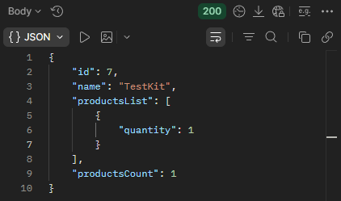

## BR-01
POST ```/api/v1/kits/:id/products``` returns 200 OK when adding non-existing products to a kit.

## Preconditions
1. The warehouse system must be active.
2. Create a kit named "TestKit".
3. Search for the kit named "TestKit".
4. Copy the kit "id".

## Test Data
Path params: id = "TestKit" id
```json
{
  "productsList": [
    {
      "id": 93,
      "quantity": 1
    }
  ]
}
```

### Steps to Reproduce
1. Select the POST method and make a request to: URL + /api/v1/kits/:id/products
2. Send a request using the "TestKit" id in Path Variables a non-existent product ID in the request body.
3. The product is not added to the kit "TestKit".
4. A status code is returned: 404 Not Found in the response.

### Expected Result
* The product is not added to the kit.
* A status code is returned: 400 Not Found in the response.

### Actual Result
* The product is added to the kit.
* The request status is 200 OK.

### Logs
N/A

### Severity
🟠 Major

### Priority
🟥 Highest

### Visual Evidence
