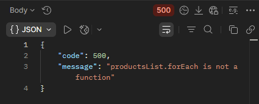

## BR-06
POST ```/api/v1/kits/:id/products``` returns 500 Internal Server Error when "productsList" contains a boolean in the request body while adding products to a kit.

## Preconditions
1. The warehouse system must be active.
2. Create a kit named "TestKit".
3. Search for the kit named "TestKit".
4. Copy the kit "id".

## Test Data
Path params: id = "TestKit" id
```json
{
  "productsList": true
}
```

### Steps to Reproduce
1. Select the POST method and send a request to: URL + /api/v1/kits/:id/products
2. Send a request using the "TestKit" ID in the Path Variables and productsList = true in the request body.

### Expected Result
* A 400 Bad Request status code is returned in the response.
* "message": "invalid input syntax for ..."

### Actual Result
* A 500 Internal Server Error status code is returned in the response.
* "message": "productsList.forEach is not a function".

### Logs
* 2026-05-03T21:03:08.655Z DEBUG Main [Request] - ::ffff:127.0.0.1 POST:/api/v1/kits/7/products - HTTP/1.1 - application/json - {"productsList":true}
* 2026-05-03T21:03:08.658Z ERROR Main Unexpected error:
* 2026-05-03T21:03:08.668Z ERROR Main {"stack":"TypeError: productsList.forEach is not a function
* 2026-05-03T21:03:08.668Z ERROR Main {"message":"productsList.forEach is not a function"}
* 2026-05-03T21:03:08.668Z DEBUG Main [Response Status] - /api/v1/kits/7/products - 500 Error interno del servidor

### Severity
🟠 Major

### Priority
🟧 High

### Visual Evidence
