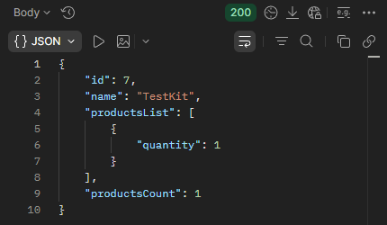

## BR-08
POST ```/api/v1/kits/:id/products``` returns 200 OK when "id" = null and quantity contains a valid value in the request body while adding products to a kit.

## Preconditions
1. The warehouse system must be active.
2. Create a kit named "TestKit".
3. Search for the kit named "TestKit".
4. Copy the kit "id".

## Test Data
Path params: id = "TestKit" id
```json
{
  "productsList": [
    {
      "id": null,
      "quantity": 1
    }
  ]
}
```

### Steps to Reproduce
1. Select the POST method and make a request to: URL + /api/v1/kits/:id/products
2. Send a request using the "TestKit" id in Path Variables, id = null and quantity = 1 in the request body.

### Expected Result
* A 400 Bad Request status code is returned in the response.
* "message": "invalid input syntax for ..."

### Actual Result
* A 200 OK status code is returned in the response.
* The product is added to the kit.

### Logs
N/A

### Severity
🟠 Major

### Priority
🟧 High

### Visual Evidence
