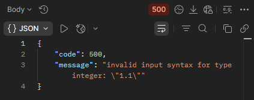

## BR-16
POST ```/api/v1/kits/:id/products``` returns 500 Internal Server Error when "id" is valid and "quantity" is a floating-point value in the request body while adding products to a kit.

## Preconditions
1. The warehouse system must be active.
2. Create a kit named "TestKit".
3. Search for the kit named "TestKit".
4. Copy the kit "id".

## Test Data
Path params: id = "TestKit" id
```json
{
  "productsList": [
    {
      "id": 1,
      "quantity": 1.1
    }
  ]
}
```

### Steps to Reproduce
1. Select the POST method and make a request to: URL + /api/v1/kits/:id/products
2. Send a request using the "TestKit" id in Path Variables, id = 1 and quantity = 1.1 in the request body.

### Expected Result
* A 400 Bad Request status code is returned in the response.
* "message": "invalid input syntax for type integer:  ..."
* The product is not added to the kit.

### Actual Result
* A 200 OK status code is returned in the response.
* "message": "input type syntax for type integer: \"1.1\""
* The product is not added to the kit.

### Logs
* 2026-05-03T22:25:51.445Z DEBUG Main [Request] - ::ffff:127.0.0.1 POST:/api/v1/kits/7/products - HTTP/1.1 - application/json - {"productsList":[{"id":1,"quantity":1.1}]}
* 2026-05-03T22:25:51.452Z ERROR Main Unexpected error:
* 2026-05-03T22:25:51.462Z ERROR Main {"stack":"InternalServerError: invalid input syntax for type integer: "1.1"
* 2026-05-03T22:25:51.462Z ERROR Main {"message":"invalid input syntax for type integer: "1.1""}
* 2026-05-03T22:25:51.463Z DEBUG Main [Response Status] - /api/v1/kits/7/products - 500 Error interno del servidor

### Severity
🟠 Major

### Priority
🟧 High

### Visual Evidence
