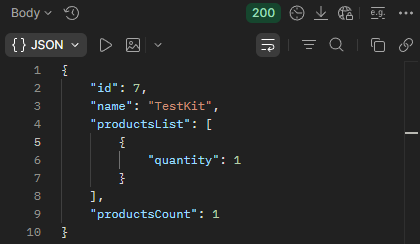

## BR-22
POST ```/api/v1/kits/:id/products``` returns 200 OK status code when the id of the product is missing and the quantity value is valid while adding products to a kit. 

## Preconditions
1. The warehouse system must be active.
2. Create a kit named "TestKit".
3. Search for the kit named "TestKit".
4. Copy the kit "id".

## Test Data
Path params: id = "TestKit" id
```json
{
    "productsList": [
        {
            "quantity": 1
        }
    ]
}
```

### Steps to Reproduce
1. Select the POST method and make a request to: URL + /api/v1/kits/:id/products
2. Send a request using the "TestKit" id in Path Variables. Omit the "id" field and "quantity" = 1.

### Expected Result
* A 400 Bad Request status code is returned in the response.
* "message": "id is required".

### Actual Result
* A 200 OK status code is returned in the response.
* The product is added to the kit.

### Logs
N/A

### Severity
🟠 Major

### Priority
🟥 Highest

### Visual Evidence
