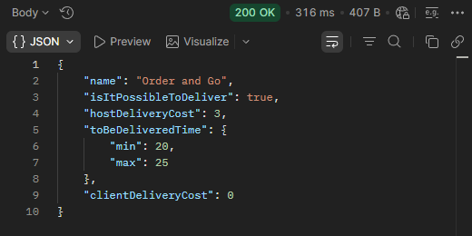

## BR-25
POST ```/order-and-go/v1/delivery``` returns 200 OK when sending a request with the data type string in the "deliveryTime" field.

## Preconditions
1. The warehouse system must be active.

## Test Data
```json
{
    "deliveryTime": "string",
    "productsCount": 4,
    "productsWeight": 1.5
}
```

### Steps to Reproduce
1. Select the POST method.
2. Enter the server URL + /order-and-go/v1/delivery.
3. Add the test data to the request body.
4. Send the request.


### Expected Result
* A 400 Bad Request status code is returned in the response.
* “message”: “invalid input syntax for integer: …“.

### Actual Result
* A 200 OK status code is returned in the response.

### Logs
N/A

### Severity
🟠 Major

### Priority
🟧 High

### Visual Evidence
