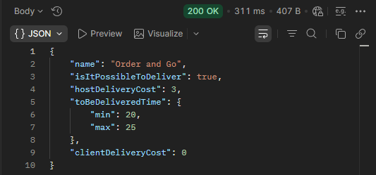

## BR-45
POST ```/order-and-go/v1/delivery``` returns 200 OK when sending a request omitting the request body.

## Preconditions
1. The warehouse system must be active.

## Test Data
```
The request body is omitted.
```

### Steps to Reproduce
1. Select the POST method.
2. Enter the URL + /order-and-go/v1/delivery.
3. Send the request.

### Expected Result
* A 400 Bad Request status code is returned.
* "message": "Request body is required".

### Actual Result
* A 200 OK status code is returned.

### Logs
N/A

### Severity
🟠 Major

### Priority
🟧 High

### Visual Evidence

