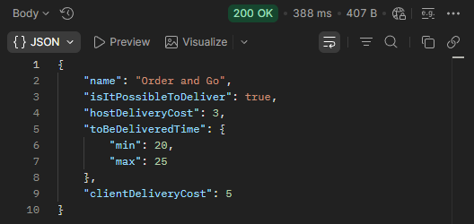

## BR-50
POST ```/order-and-go/v1/delivery``` returns "true" in "isItPossibleToDeliver" in the response when "deliveryTime" = 23.

## Preconditions
1. The warehouse system must be active.

## Test Data
```json
{
    "deliveryTime": 23,
    "productsCount": 4,
    "productsWeight": 1.5
}
```

### Steps to Reproduce
1. Select the POST method.
2. Enter the URL + /order-and-go/v1/delivery.
3. Add the test data to the request body.
4. Send the request.

### Expected Result
* A 200 OK status code is returned.
* "isItPossibleToDeliver": false.

### Actual Result
* A 200 OK status code is returned.
* "isItPossibleToDeliver": true.

### Logs
N/A

### Severity
🟠 Major

### Priority
🟧 High

### Visual Evidence

